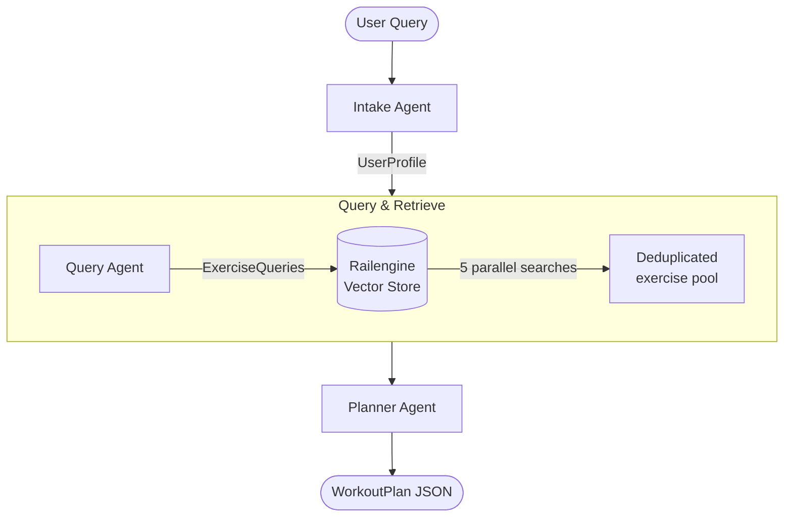

# gym-pt

An AI-powered personal trainer built on [Railtracks](https://railtracks.org) and
[Railengine](https://railengine.ai) by [Railtown AI](https://railtown.ai).

## Overview

`gym-pt` is a three-stage agentic pipeline that turns a plain-English fitness request
into a structured, day-by-day workout plan. It uses **Railengine** for semantic exercise
retrieval over a catalog of 873 exercises and **Railtracks** to orchestrate the agents.

## Pipeline



### Stage 1 — Intake Agent

Parses a free-text user request and extracts a structured `UserProfile`:

```python
class UserProfile(BaseModel):
    goal: GoalType          # strength | cardio | powerlifting | …
    days_per_week: int      # 1–7
    equipment: list[str]    # ["dumbbell", "machine", …]
    level: FitnessLevel     # beginner | intermediate | advanced
    notes: str | None       # injuries, preferences, constraints
```

### Stage 2 — Query & Retrieve

The `Query Agent` generates five targeted semantic search queries from the profile —
one per session phase. These are fanned out **in parallel** against the Railengine
vector store and the results are deduplicated into a single exercise pool.

```python
class ExerciseQueries(BaseModel):
    warmup_query: str       # top_k = 4
    primary_query: str      # top_k = 5
    secondary_query: str    # top_k = 6
    equipment_query: str    # top_k = 3
    cooldown_query: str     # top_k = 3
```

Each field carries a fixed `top_k` that controls how many exercises are fetched
per phase, giving the pool a deliberate composition (21 candidates total before
deduplication).

### Stage 3 — Planner Agent

Receives the user profile and a filtered exercise list (id, equipment, muscles,
category) and arranges them into a `WorkoutPlan`:

```python
class WorkoutPlan(BaseModel):
    title: str | None
    days: list[WorkoutDay]
    notes: str | None

class WorkoutDay(BaseModel):
    day_index: int
    focus: str | None
    exercises: list[PlannedExercise]   # each has exercise_id, sets, reps
```

The plan is validated against the retrieved exercise IDs before being returned —
the planner is not allowed to invent exercises outside the pool.

## Running the End-to-End Pipeline

```bash
uv run python scripts/e2e.py
```

Or invoke programmatically:

```python
from scripts.e2e import flow

result = flow.invoke(
    "Intermediate plan, 3 days per week, strength training, "
    "dumbbells and machines."
)
# result keys: "profile", "exercises", "plan"
```

The pipeline also renders a standalone HTML workout card to `metadata/e2e_plan.html`.

## Project Structure

```
src/gym_pt/
├── agents/
│   ├── agents.py          # Intake, Query, and Planner agent definitions
│   ├── tools.py           # retrieve_exercises, query_and_retrieve
│   └── messages.py        # System prompts for all three agents
├── models/
│   ├── exercise.py        # Exercise schema
│   └── plan.py            # UserProfile, ExerciseQueries, WorkoutPlan schemas
├── railengine/
│   ├── retrieval.py       # search_exercises + filter helpers
│   └── query_protocol.py  # SearchQueryBuilder protocol
└── utils/
    └── html.py            # HTML rendering utilities
scripts/
├── e2e.py                 # Full end-to-end run
├── smoke_intake.py
├── smoke_query_and_retrieve.py
└── smoke_plan.py
fixtures/
├── sample_exercise_queries.json
└── sample_plan.json
```

## Setup

```bash
# Install dependencies
uv sync

# Configure credentials
cp .env.example .env
# Set ANTHROPIC_API_KEY, RAILENGINE_PAT, RAILENGINE_ENGINE_ID
```

## Tech Stack

| Component | Role |
|---|---|
| **Railtracks** | Agent orchestration, structured output, tool calling |
| **Railengine** | Vector search over the 873-exercise catalog |
| **Anthropic Claude** | LLM backend for all three agents |
| **Pydantic v2** | Typed schemas and validation between pipeline stages |
| **asyncio** | Parallel query fan-out in the retrieval stage |
