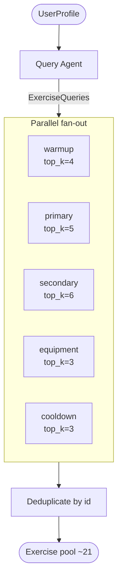
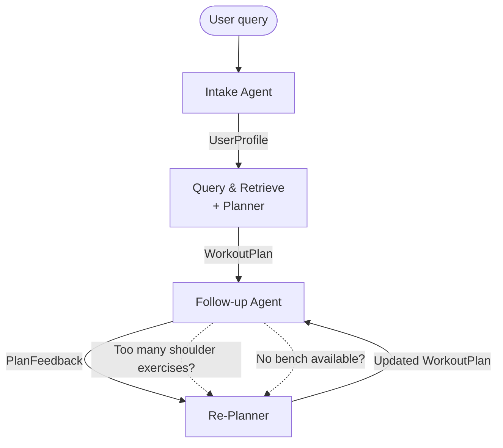
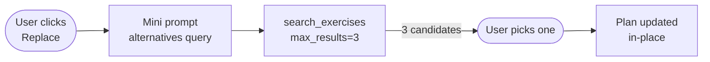
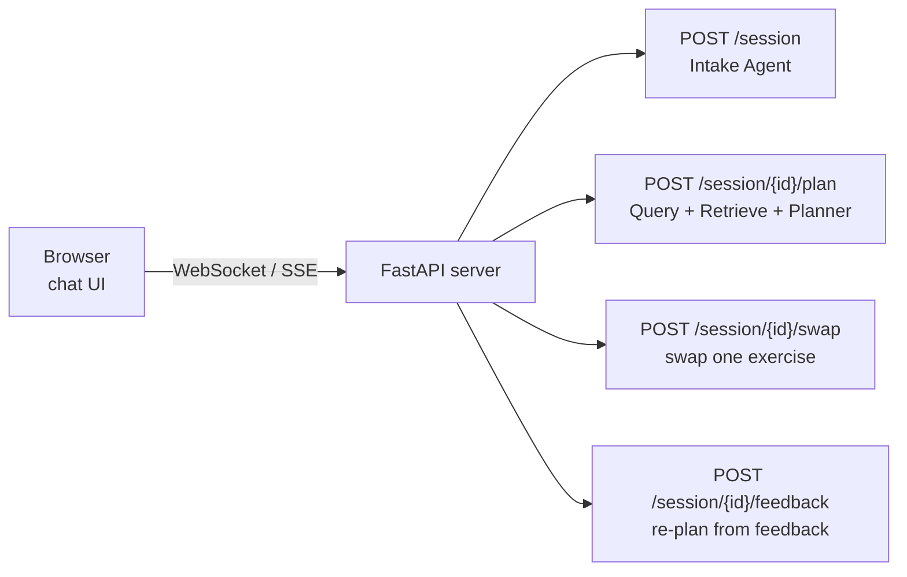

# gym-pt — Project Presentation

> An AI-powered personal trainer: from a plain-English request to a structured,
> day-by-day workout plan.

---

## Table of Contents

1. [How Retrieval Works](#1-how-retrieval-works)
2. [How `query_and_retrieve` Works](#2-how-query_and_retrieve-works)
3. [The Planning Process](#3-the-planning-process)
4. [Directions for the Future](#4-directions-for-the-future)
5. [Current Limitations](#5-current-limitations)

---

## 1. How Retrieval Works

Retrieval is built on **Railengine**, a vector store that holds 873 exercises,
each embedded as a semantic vector alongside structured metadata (equipment,
muscles, category, level, etc.).

### The Exercise Schema

Every item in the catalog is modelled as:

```python
class Exercise(BaseModel):
    id: str                      # stable catalog identifier
    name: str
    category: str                # strength | cardio | stretching | …
    equipment: str | None        # dumbbell | barbell | machine | …
    level: str                   # beginner | intermediate | advanced
    mechanic: str | None         # compound | isolation
    force: str | None            # push | pull | static
    primaryMuscles: list[str]
    secondaryMuscles: list[str]
    instructions: list[str]
    images: list[str]
```

### The Search Call

A single retrieval call issues a **natural-language query** against the vector
store and returns the top-k semantically closest exercises:

```python
# src/gym_pt/railengine/retrieval.py
async def search_exercises(
    query: str,
    *,
    max_results: int = 10,
    vector_store: VectorStore = "VectorStore1",
) -> list[Exercise]:
    async with Railengine(pat=..., engine_id=...) as client:
        stream = client.search_vector_store(
            vector_store=vector_store,
            query=query,
            model=Exercise,
        )
        async for item in stream:
            out.append(item)
            if len(out) >= max_results:
                break
    return out
```

The query is a short natural-language phrase such as
`"compound pulling strength exercises for back"`. Railengine converts it to a
vector and returns the nearest neighbors in the exercise embedding space.

Post-retrieval, two deterministic filters are also available for narrowing results
by equipment or fitness level when needed:

```python
filter_by_equipment(exercises, "dumbbell", "machine")
filter_by_level(exercises, "intermediate")
```

---

## 2. How `query_and_retrieve` Works

A single generic query would miss important session phases (warmup, cooldown,
isolation work). Instead, `query_and_retrieve` builds **five phase-specific
queries** and fans them out in parallel.

### Step 1 — Query Agent generates structured queries

The `Query Agent` receives the `UserProfile` as input and returns an
`ExerciseQueries` object — one query string per session phase:

```python
class ExerciseQueries(BaseModel):
    warmup_query: str       # top_k = 4  — cardio / dynamic movement
    primary_query: str      # top_k = 5  — compound lifts aligned with goal
    secondary_query: str    # top_k = 6  — accessory / isolation work
    equipment_query: str    # top_k = 3  — equipment-specific gap-fillers
    cooldown_query: str     # top_k = 3  — static stretches / recovery
```

Example output for an intermediate strength trainee with dumbbells and machines:

```json
{
  "warmup_query": "light cardio warmup for beginners",
  "primary_query": "compound strength exercises for full body beginners",
  "secondary_query": "isolation exercises for arms chest and shoulders",
  "equipment_query": "beginner dumbbell and machine lower body strength exercises",
  "cooldown_query": "static stretching full body recovery flexibility holds"
}
```

The `top_k` values are encoded directly on the Pydantic field via
`json_schema_extra`, so the retrieval loop reads them automatically — no
magic constants scattered around the codebase:

```python
primary_query: str = Field(
    ...,
    description="Main compound movements …",
    json_schema_extra={"top_k": 5},
)
```

### Step 2 — Parallel fan-out retrieval

All five searches fire at the same time with `asyncio.gather`:

```python
# src/gym_pt/agents/tools.py
async def query_and_retrieve(user_profile: UserProfile) -> list[Exercise]:
    output = await rt.call(Query_Agent, str(user_profile))
    queries: ExerciseQueries = output.structured

    coroutines = [
        retrieve_exercises(
            getattr(queries, field_name),
            top_k=meta.json_schema_extra["top_k"],
        )
        for field_name, meta in ExerciseQueries.model_fields.items()
    ]

    results = await asyncio.gather(*coroutines)

    # Deduplicate by id, preserving query-priority order
    seen: set[str] = set()
    exercises: list[Exercise] = []
    for batch in results:
        for ex in batch or []:
            if ex.id not in seen:
                seen.add(ex.id)
                exercises.append(ex)

    return exercises   # up to ~21 exercises (4+5+6+3+3) before dedup
```

### Data flow diagram



---

## 3. The Planning Process

Once the exercise pool is assembled, the `Planner Agent` arranges it into a
week-long plan.

### What the planner receives

Only the fields needed for scheduling are forwarded — full instructions and images
are stripped to keep the context window focused:

```python
fields_to_keep = ["id", "equipment", "primaryMuscles", "secondaryMuscles", "category"]
filtered_exercises = [
    {k: ex.__getattribute__(k) for k in fields_to_keep}
    for ex in exercises
]

plan_query = {"profile": profile, "exercises": filtered_exercises}
plan_output = await rt.call(Planner_Agent, str(plan_query))
```

### Planner rules (from the system prompt)

- Only use exercises from the provided pool — no hallucinated exercises.
- Assign exactly `days_per_week` workout days.
- Distribute muscle groups evenly; avoid training the same muscles on consecutive days.
- Every day must open with a warmup and close with a cooldown.
- Respect equipment and any constraints in the user's notes.

### Output schema

```python
class WorkoutPlan(BaseModel):
    title: str | None
    notes: str | None
    days: list[WorkoutDay]

class WorkoutDay(BaseModel):
    day_index: int
    focus: str | None          # e.g. "Back & Biceps"
    exercises: list[PlannedExercise]

class PlannedExercise(BaseModel):
    exercise_id: str           # must match a catalog id
    name: str
    sets: int | None
    reps: str | None           # e.g. "10-12" or "5 min"
```

### Example output (3-day strength plan)

```json
{
  "title": "Beginner Strength Plan – 3 Days/Week",
  "days": [
    {
      "day_index": 0,
      "focus": "Chest & Shoulders",
      "exercises": [
        {"exercise_id": "Walking_Treadmill",   "name": "Walking Treadmill",   "sets": 1, "reps": "5 min"},
        {"exercise_id": "Incline_Dumbbell_...", "name": "Incline Dumbbell …", "sets": 3, "reps": "10-12"},
        {"exercise_id": "Runners_Stretch",     "name": "Runners Stretch",     "sets": 1, "reps": "30-45 sec"}
      ]
    }
  ],
  "notes": "Rest 60-90 seconds between sets. Train on non-consecutive days."
}
```

### Post-plan validation

After the LLM returns the plan, every `exercise_id` is checked against the
retrieved pool. Any id that was not in the pool raises an error, preventing
hallucinated exercises from reaching the user.

```python
validate_plan_exercise_ids(plan_struct.model_dump(), exercises)
```

### HTML rendering

The final output is enriched with the full exercise instructions and rendered as
a self-contained HTML file (`metadata/e2e_plan.html`) for easy viewing.

---

## 4. Directions for the Future

### 4.1 Adaptive query pool size

Right now the five `top_k` values are hardcoded on the `ExerciseQueries` fields
(4 + 5 + 6 + 3 + 3 = 21 candidates). A user with only bodyweight equipment needs
a much smaller, more focused pool than one with a full commercial gym. Similarly,
a 5-day programme needs more variety than a 2-day one.

**Proposal:** compute `top_k` dynamically from the profile before building
queries.

```python
def compute_top_k(profile: UserProfile) -> dict[str, int]:
    equipment_factor = max(1, len(profile.equipment))
    day_factor = profile.days_per_week

    base = 3 + equipment_factor          # more equipment → more candidates per slot
    return {
        "warmup_query":    2 + day_factor // 2,
        "primary_query":   base + day_factor,
        "secondary_query": base + day_factor + 1,
        "equipment_query": equipment_factor,
        "cooldown_query":  2,
    }
```

This would be wired into `query_and_retrieve` so the pool naturally scales with
the user's context.

### 4.2 Adaptive exercise pool size for the planner

The planner currently receives all deduplicated exercises from the retrieval
stage. For a 5-day plan that is fine; for a 2-day plan it results in a very large
context with many irrelevant exercises.

**Proposal:** target a pool-to-day ratio (e.g. ~7 exercises per planned day) and
trim or re-rank after deduplication. Alternatively, let the Query Agent know the
target pool size via a system-prompt instruction so it adjusts its own `top_k`
reasoning.

### 4.3 Follow-up questions and feedback loop

Today the pipeline is a single pass: one prompt → one plan, no iteration. Adding
a feedback loop would let users refine the plan interactively.

**Proposed flow:**



The Follow-up Agent would maintain conversation history and emit a structured
`PlanFeedback` object (liked exercises, disliked exercises, constraint updates)
that the Re-Planner can act on.

### 4.4 Exercise swap / search-on-demand

Instead of a full re-plan, users often just want to swap a single exercise they
cannot perform. This maps naturally to the existing retrieval infrastructure:



The same `search_exercises` function that powers the main pipeline can serve
individual swap requests with a focused, single-exercise query — no need for a
new retrieval stack.

### 4.5 Chat UI

All current interaction happens through a Python script. A chat interface would
unlock real-time feedback, swaps, and follow-up questions.

**Proposed architecture:**



Railtracks already streams agent output, so the API layer would largely be a
thin wrapper around the existing flow. The UI state is a `WorkoutPlan` object
that gets progressively updated as agents respond.

---

## 5. Current Limitations

| Limitation | Description |
|---|---|
| **Single goal** | `UserProfile.goal` is a single enum value. A user who wants "strength and fat loss" must pick one. There is no multi-objective planning. |
| **Fixed query pool size** | The five `top_k` values (4, 5, 6, 3, 3) are static. They do not adapt to the number of training days, available equipment, or session length. |
| **Fixed exercise pool size** | The planner always receives the full deduplicated retrieval result regardless of programme length, which creates unnecessary noise in the context. |
| **One-pass pipeline** | The pipeline runs once and returns a plan. There is no iteration, refinement, or correction step after the initial output. |
| **No follow-up / feedback mechanism** | Users cannot say "too many shoulder exercises" or "I don't have a bench" after seeing the plan. Every change requires a full re-run from scratch. |
| **No exercise swap UI** | Swapping an exercise requires re-running the whole pipeline. There is no lightweight "suggest alternatives" flow. |
| **No chat interface** | All interaction is via a Python script. There is no browser-based UI for real users. |
| **No session memory** | Each invocation is stateless. The system has no memory of previous plans, preferences, or feedback from the same user across sessions. |
